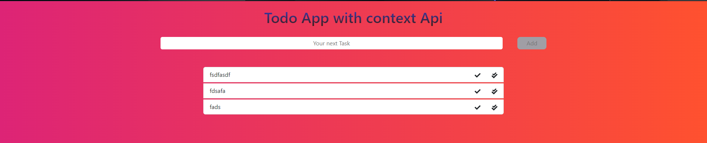

# This project is done Under the Hitesh Chodhary's React Course

> Some Changes in css as per my liking

This Application is not Full stack it's just using Context Api and took around 5 hours with the help of **Bootstrap** and **reactstrap**
and **reacticons**, **uuid** such libaray

[livelink](https://react-todo-lake-eight.vercel.app/)
